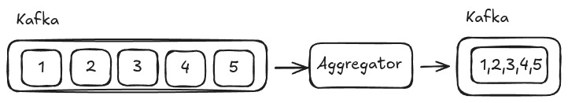

# Aggregator

Usually, in distribuited systems, we would like to process message as a whole that have been sent as unit. When designing an aggregator we have some specific key points to thing about:

- Correlation: How do we group the incoming messages?
- Completeness Condition: When the group of messages are ready to be published foward?
- Aggregation Algorithm: How do we group the valid incoming message?

### Details

We must use the previous steps to be able to implemented our expected Aggregator. When aggregator receives the events, it must check if we need to group this data (Correlation), if it's the first one, we must sabe inside a set with it's id, we already exists we add the new message inside it using an algorithm (Aggregation Algorithm). After add the current message inside the set, we should check if it's already completed (Completeness Condition).




### Installation
In your terminal, inside aggreagator folder, you can type `make compose-up`

So, we have our `Aggregator`:

```go
type Aggregator struct {
	Aggregates             map[string][]Aggregate
	PublishEventHandler    AggregatorPublishEventHandler
	IsCompleteEventHandler AggregatorIsCompleteEventHandler
}
```
- Aggregates is our data structure to store the data that come from kafka and process until have bemm completed
- PublishEventHandler is our interface that you can implement to make whatever you want to the completed dataset
- IsCompleteEventHandler is our interface that you must implement you code to check if it's completed

In this example we have:
- IsCompleteEventHandler
```go
func (i *IsCompleteEventHandler) IsComplete(messages []core.Aggregate) bool {
	return len(messages) == 5
}
```
- PublishEventHandler
```go
func (p *PublishEventHandler) Publish(aggregates []core.Aggregate) error {
	var messages []interface{}
	for _, aggregate := range aggregates {
		messages = append(messages, aggregate.Messages...)
	}

	msgBytes := []byte(fmt.Sprintf("%v", messages))

	kafkaMsg := &sarama.ProducerMessage{
		Topic: "aggregated-topic",
		Value: sarama.ByteEncoder(msgBytes),
	}

	_, _, err := p.Producer.SendMessage(kafkaMsg)
	if err != nil {
		return err
	}
	return nil
}
```